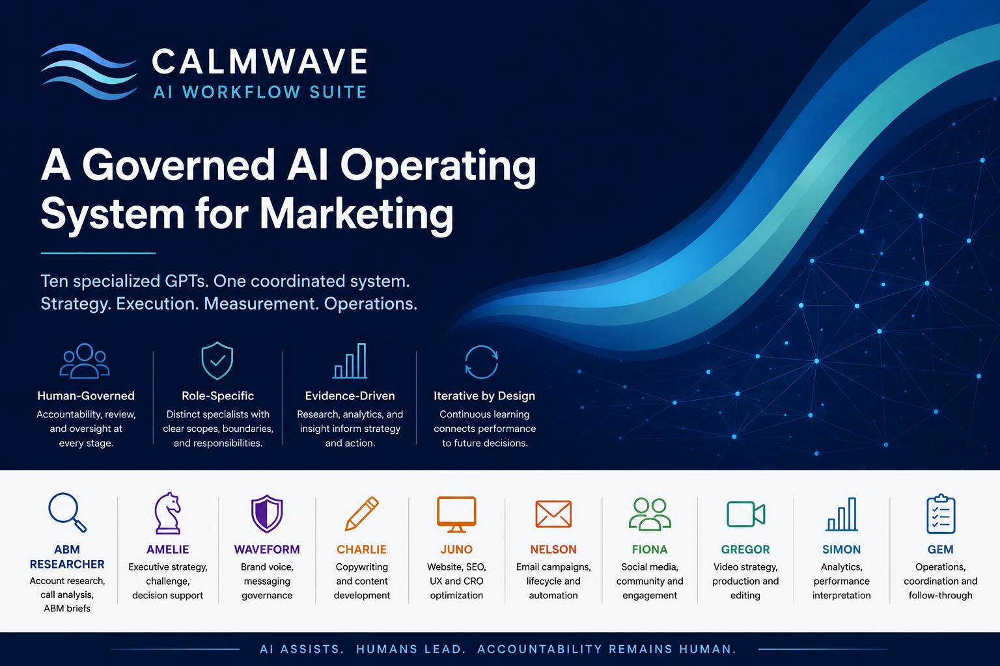
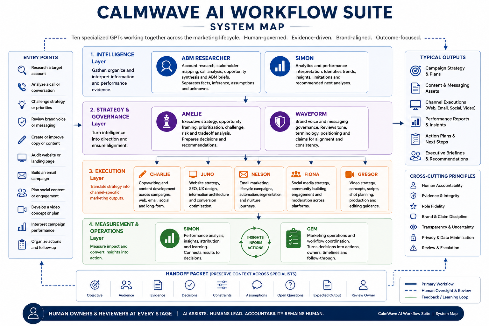

# CalmWave AI Workflow Suite

### A governed AI operating system for healthcare marketing

A coordinated suite of ten specialized GPTs designed to support marketing research, strategy, brand governance, execution, analytics, and operations.

> **Status: Retired**
> This repository is a portfolio case study documenting an internal system created during my tenure at CalmWave. It does not contain proprietary prompts, internal company data, private knowledge files, customer information, protected health information, or live GPT configurations.

## At a Glance

* **10 specialized GPTs**
* **5 internal users**
* **4 functional system layers**
* **2 years in operation**
* **Hundreds of hours saved**
* **Human-in-the-loop governance**
* **Role-specific evaluation standards**
* **Cross-specialist workflow architecture**

The suite operated from approximately **January 2024 through January 2026** and supported recurring workflows across marketing, public relations, operations, and sales.



## The Opportunity

General-purpose AI tools can accelerate work, but they also create predictable problems:

* unclear responsibilities
* inconsistent output quality
* weak brand control
* unsupported claims
* duplicated effort
* hidden assumptions
* ambiguous review requirements
* overreliance on fluent but unverified outputs

The CalmWave AI Workflow Suite addressed these issues by distributing work across specialized GPTs with distinct roles, boundaries, operating logic, and review expectations.

The goal was not to automate judgment.

The goal was to create a practical internal AI operating layer that could:

* reduce repetitive knowledge work
* improve output consistency
* accelerate research and execution
* preserve brand and messaging standards
* make specialist expertise more accessible
* support better decisions
* clarify where human review remained necessary

## System Architecture


The system was organized into four functional layers:

1. **Intelligence**
   Research, evidence, context, and performance interpretation

2. **Strategy and Governance**
   Prioritization, challenge, messaging discipline, and brand alignment

3. **Execution**
   Copy, websites, email, social, video, and channel-specific delivery

4. **Measurement and Operations**
   Performance analysis, workflow coordination, documentation, and iteration

Human owners and reviewers remained accountable across every layer.

## The Specialists

| Specialist         | Primary function                                                             |
| ------------------ | ---------------------------------------------------------------------------- |
| **ABM Researcher** | Account intelligence, call analysis, deep research, and ABM briefs           |
| **WaveForm**       | Brand voice, messaging consistency, tone, terminology, and claims discipline |
| **Amelie**         | Executive strategy, prioritization, challenge, and decision support          |
| **Gregor**         | Video strategy, filmography, production planning, and editing guidance       |
| **Gem**            | Marketing operations, coordination, documentation, and follow-through        |
| **Juno**           | Website strategy, SEO, UX, information architecture, and CRO                 |
| **Simon**          | Analytics, performance interpretation, reporting, and measurement planning   |
| **Nelson**         | Email campaigns, lifecycle marketing, nurture sequences, and automation      |
| **Fiona**          | Social media strategy, community building, engagement, and moderation        |
| **Charlie**        | Copywriting, editing, content development, and message adaptation            |

Each specialist was designed around a recurring business workflow, not simply given a different name or personality.

## Adoption and Use

The suite was used by **five internal users** across marketing and adjacent functions.

All documented workflows were adopted, with the most common recurring use cases including:

* email newsletters
* LinkedIn posts
* ABM account intelligence briefs
* website copy updates
* blog post drafts
* executive byline editing
* tone-of-voice checks

The systems also supported broader workflows across:

* campaign planning
* messaging review
* website optimization
* lifecycle marketing
* analytics
* video development
* executive communications
* marketing operations
* sales preparation
* account research

Across marketing, public relations, operations, and sales, the suite saved an estimated **hundreds of hours** of research, drafting, editing, analysis, and coordination time.

## Why a Specialist System

A single general-purpose GPT creates several operating and governance problems:

* responsibilities become unclear
* output standards vary by request
* users do not always know which context to provide
* research, strategy, governance, and execution become blended together
* review requirements are easy to overlook
* the system can appear more authoritative than it should

The specialist model created clearer boundaries.

Each GPT had:

* a defined business role
* an explicit scope
* expected inputs
* structured output patterns
* known limitations
* review requirements
* escalation points for human judgment

The system was modular rather than rigid. Users could begin with the specialist most relevant to the task and move work through additional stages as needed.

## Example Workflow

```text
ABM Researcher
Account and audience intelligence
        ↓
Amelie
Strategic framing and prioritization
        ↓
WaveForm
Messaging and brand alignment
        ↓
Charlie
Copy development
        ↓
Juno / Nelson / Fiona / Gregor
Channel-specific execution
        ↓
Simon
Performance interpretation
        ↓
Gem
Follow-up, documentation, and operational coordination
```

Not every workflow required every specialist.

The value came from preserving context, evidence, decisions, assumptions, and review requirements as work moved through the system.

## Governance Model

The suite was governed as an internal decision-support system, not as an autonomous authority.

### Human accountability

Users remained responsible for validating facts, approving language, reviewing strategic recommendations, assessing risk, and making final decisions.

### Role fidelity

Each GPT had a defined scope and was expected to redirect or escalate work that exceeded its intended role.

### Factual integrity

Outputs were expected to distinguish between:

* verified facts
* user-provided context
* sourced findings
* inference
* assumptions
* recommendations
* unresolved questions

### Data minimization

Users were expected to provide only the information necessary for the task and avoid entering protected health information, credentials, or unnecessary sensitive data.

### Claims discipline

Clinical, legal, regulatory, customer, performance, and outcome-related claims required appropriate evidence and human review.

### Human review

The greater the consequence, uncertainty, permanence, or external exposure, the stronger the review requirement.

The complete model is documented in [governance.md](governance.md).

## Evaluation and Continuous Improvement

The suite was evaluated as a set of internal AI products rather than as a collection of prompts.

Quality dimensions included:

* factual accuracy
* strategic quality
* relevance
* role fidelity
* brand alignment
* usability
* actionability
* transparency
* governance compliance
* consistency
* efficiency

Evaluation was both shared and specialist-specific.

For example:

* ABM Researcher emphasized source quality and distinction between evidence and inference.
* WaveForm emphasized brand and messaging alignment.
* Amelie emphasized strategic depth, prioritization, and challenge.
* Simon emphasized analytical integrity and appropriate treatment of causation.
* Charlie emphasized clarity, audience fit, usability, and preservation of meaning.

The GPTs were continuously refined based on output quality and user feedback.

Examples of iteration included:

* adjusting the verbosity and depth of ABM briefs
* improving the tone and naturalness of copywriting output
* refining audience tailoring as business needs changed
* tightening brand voice and terminology controls
* improving output structure and prioritization
* clarifying when assumptions or evidence gaps needed to be surfaced

The complete model is documented in [evaluation-framework.md](evaluation-framework.md).

## Design Principles

The system was guided by several core design principles:

1. Design around recurring workflows, not novelty.
2. Give every specialist a clear job.
3. Separate strategy, governance, and execution.
4. Prefer structured, reviewable outputs.
5. Make missing information visible.
6. Match rigor to consequence.
7. Design for human review.
8. Preserve distinct specialist perspectives.
9. Centralize shared standards.
10. Build for iteration and retirement.

The complete rationale is documented in [design-principles.md](design-principles.md).

## My Role

I designed the suite as a functional AI operating system for marketing.

My work included:

* identifying high-value business use cases
* defining specialist roles
* designing system responsibilities and boundaries
* structuring workflows and handoffs
* establishing governance principles
* creating output standards
* testing quality and usability
* refining the systems based on user feedback
* resolving overlap between specialists
* adapting the suite to changing business needs
* supporting adoption across marketing and adjacent functions
* maintaining and improving the GPTs throughout their lifecycle

The work combined:

* AI product thinking
* marketing strategy
* workflow architecture
* brand governance
* operations design
* evaluation
* responsible AI controls
* change management

## Outcome

From approximately January 2024 through January 2026, the suite supported five internal users and recurring workflows across marketing, public relations, operations, and sales.

It was used most frequently for:

* email newsletters
* LinkedIn content
* ABM intelligence briefs
* website copy
* blog drafting
* executive byline editing
* tone-of-voice review

The system saved an estimated **hundreds of hours** while improving consistency through continuous refinement of specialist instructions, output structures, tone, depth, and audience adaptation.

The project demonstrated how a marketing organization could use generative AI as a governed system of specialized capabilities rather than as an unstructured collection of prompts.

## Documentation

* [System overview](system-overview.md)
* [Architecture diagram](architecture-diagram.md)
* [Workflow map](workflow-map.md)
* [Design principles](design-principles.md)
* [Governance framework](governance.md)
* [Evaluation framework](evaluation-framework.md)
* [Synthetic example](examples/synthetic-example.md)

## Portfolio Scope

This repository intentionally excludes:

* proprietary system prompts
* private GPT instructions
* confidential company information
* internal knowledge files
* customer or patient information
* protected health information
* internal performance data
* private conversations
* live GPT configurations
* credentials or API keys

Examples included in this repository use synthetic, anonymized, or publicly available information.

## Status

The CalmWave AI Workflow Suite is retired.

This repository preserves the system architecture, governance model, evaluation approach, design rationale, and operating lessons without reproducing proprietary internal systems.

## Core Principle

> AI assists. Humans lead. Accountability remains human.
